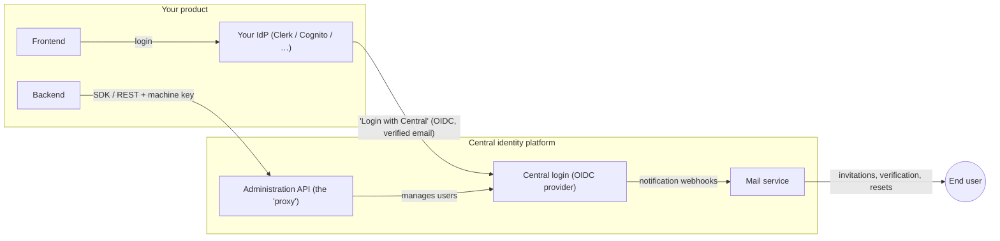

# How the pieces fit together

This page explains the moving parts a product team interacts with. Names of
concrete companies, products, and domains are deliberately absent — your
integration bundle carries your specific values.

## The big picture

- **End users authenticate through your product's existing IdP**, which
  delegates the credential step to the central login via a standard OIDC
  connection ("Login with Central"). Identities link strictly by
  **verified email**.
- **Your backend administers its users** (create, onboard, list, support
  operations) exclusively through the **administration API**, using the SDK
  in your language. You never talk to the central IdP directly.
- **All email** (invitations, verification codes, password resets) is sent
  centrally by the mail service; your product's transactional email is
  unaffected.

## One person, one identity

A person who uses two products has **one** central identity with two
*memberships*. Consequences you must design for:

- Creating a user whose email already has an identity fails with **409** and
  returns the existing id — call **onboard** instead (see
  [operations.md](operations.md#create-vs-onboard)).
- MFA reset, password reset, lock and unlock are **global**: they affect the
  person across every product. The API marks these with
  `globalEffect: true`.
- Your product's scope is enforced server-side: you can only see and touch
  users onboarded into your product (404 outside it, 403 for foreign
  scopes).

## Environments

Two isolated environments exist: **development** and **production**. Each
has its own central instance, API endpoint, and credentials; nothing is
shared between them. In development, emails are **captured, not delivered** —
your integration tests read them back through the platform team's tooling
instead of a mailbox.

## Credentials you hold

| Credential | Used for | Notes |
|---|---|---|
| OIDC client id + secret | the "Login with Central" connection in your IdP | per environment |
| Machine key (JSON) | SDK authentication to the administration API | keep in a secret store; the SDK mints short-lived tokens from it automatically |

Both are issued during onboarding, per environment, together with your four
SDK configuration values (endpoint, product id, issuer, project id).
