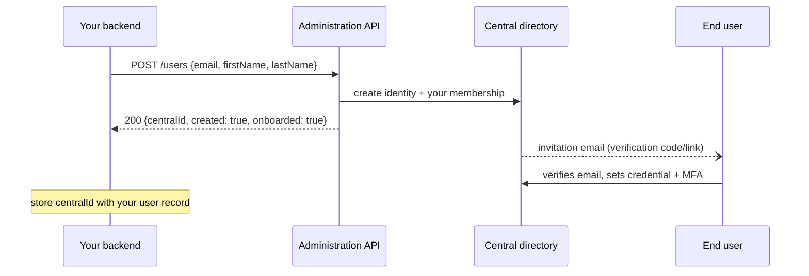
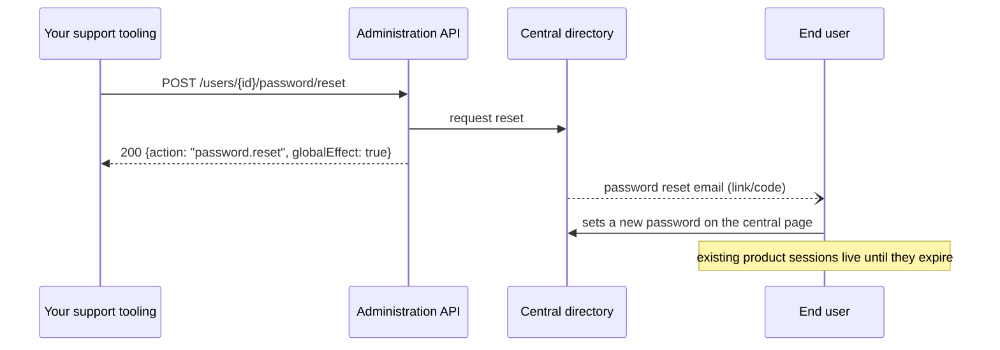
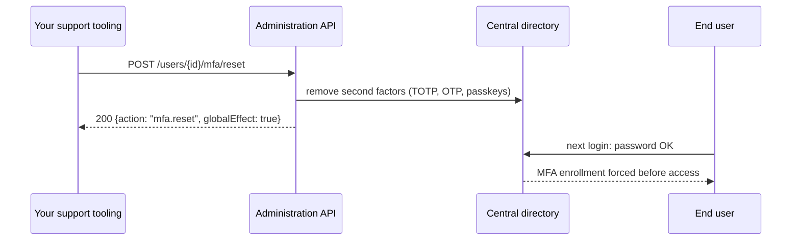
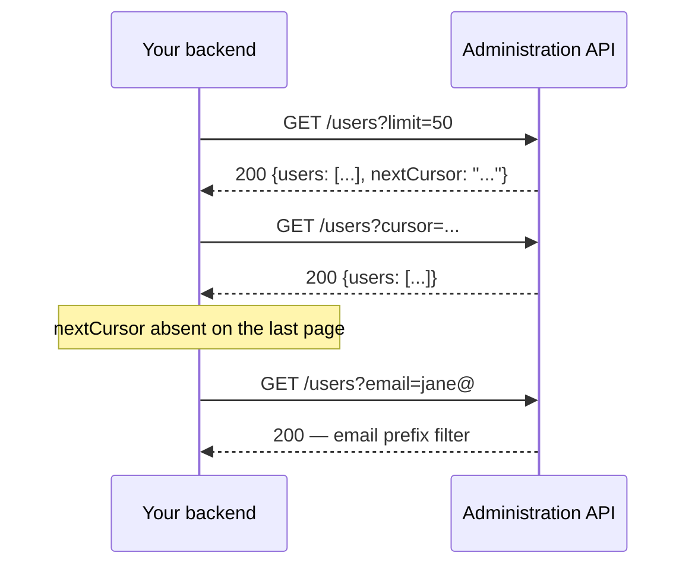

# Operations reference

The API surface is 13 operations, all product-scoped under
`/v1/products/{product}/…` and specified in [openapi.yaml](../openapi.yaml).
This page explains the semantics the spec alone can't carry. Every SDK maps
these 1:1 (method names in your language's convention).

## Conventions

- **Authentication**: `Authorization: Bearer <token>` — the SDKs mint and
  refresh tokens from your machine key automatically.
- **Idempotency**: every mutation takes an `Idempotency-Key` header. SDKs
  generate one per call; pass your own (and reuse it) when you retry a
  failed call yourself — the retry becomes an exact replay.
- **Errors**: RFC 9457 problem JSON (`status`, `title`, `detail`,
  `errors[]`). SDKs raise a typed error carrying these fields.
- **Scoping**: users outside your product are `404`; another product's
  scope is `403`. This is enforced server-side on every operation.

## Creating a NEW user

The person has no central identity yet — `create-user` makes one, adds your
product's membership, and delivers the invitation:



`inviteMode: "returnCode"` returns the verification code to you instead of
emailing it — useful when you deliver invites through your own channel.

## Onboarding an EXISTING user into your product

The person already has a central identity (created by another product) but
is not a member of yours yet. `create-user` tells you so with a 409; you
onboard instead — no email is sent, nothing changes for the user's
credential:

```mermaid
sequenceDiagram
    participant B as Your backend
    participant API as Administration API
    participant C as Central directory
    B->>API: POST /users {email}
    API-->>B: 409 + existing centralId in error details
    B->>API: POST /users/onboard {centralId}
    API->>C: add your product's membership
    API-->>B: 200 {centralId, onboarded: true}
    Note over B: store centralId; the user logs in with their EXISTING central credential
```

Onboarding directly by email works too — but **only verified emails match**
(an unverified address is 404 by design: never link an identity through an
address nobody proved they own). Onboarding twice is a no-op
(`onboarded: false`).

## Password reset

Support-initiated, global effect — the person's ONE central credential is
reset, which touches every product they use:



## MFA reset

The classic "lost my phone" flow. Removes ALL second factors; the central
login forces re-enrollment on the next sign-in:



Verify the requester out-of-band before calling this — it is the highest-
leverage social-engineering target in any support flow. A 409 means a
factor on the account needs the platform operator.

## Listing your product's users

Served from the membership index — you only ever see users onboarded into
YOUR product:



## Changing a user's email

**Not available through the API today.** The verified email is the key that
links the central identity to your IdP's account — changing it involves
every product the person uses, not just yours, so it is currently a
platform-operator procedure. Contact the operator; a first-class flow is
planned.

## Reading users

- `list-users` — cursor-paginated members of your product; optional email
  prefix filter.
- `get-user` — one member's detail; live directory state (a centrally
  locked user shows `status: "locked"`).
- `get-user-audit` — the user's credential-plane timeline within your
  scope: your product's events plus global-effect events from any product.
  You never see another product's local events.

## Support operations (all global-effect except verification)

| Operation | Effect | Notes |
|---|---|---|
| `send-verification-email` | resend invitation/verification | 409 if already verified |
| `reset-password` | password reset email | global |
| `reset-mfa` | removes second factors; re-enroll at next login | global; 409 if a factor needs operator support |
| `lock-user` / `unlock-user` | central deactivate / reactivate | global; issued product sessions live until expiry — cut those off product-side |

## Sessions

- `list-sessions` — the user's central sessions.
- `terminate-session` — one session; the session must belong to the user
  (404 otherwise).
- `terminate-all-sessions` — all of them. As with lock: product-side tokens
  already issued are unaffected until they expire.
